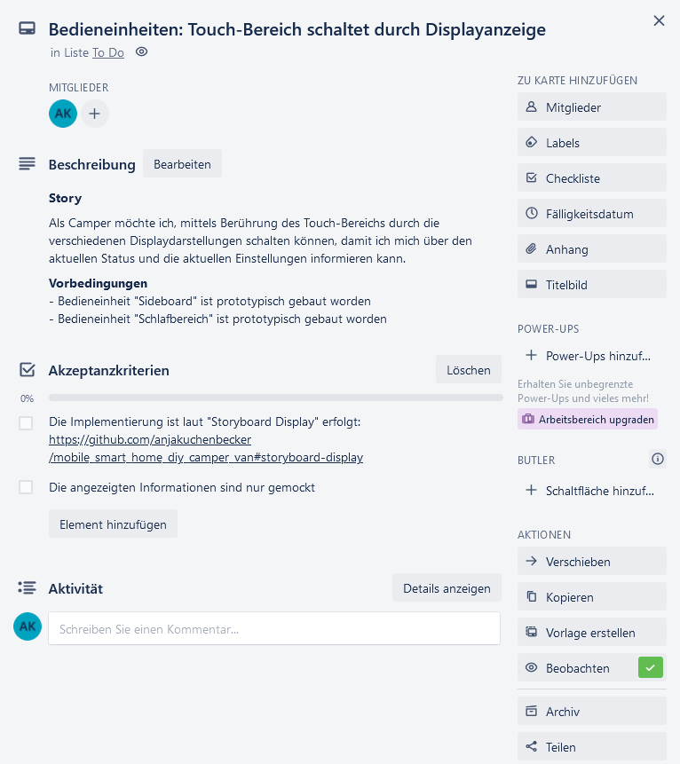
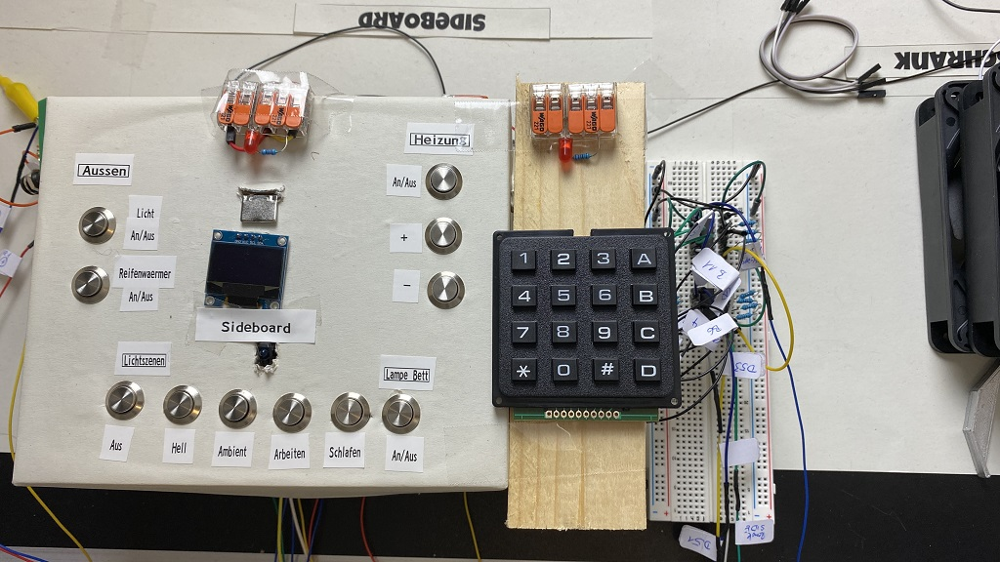
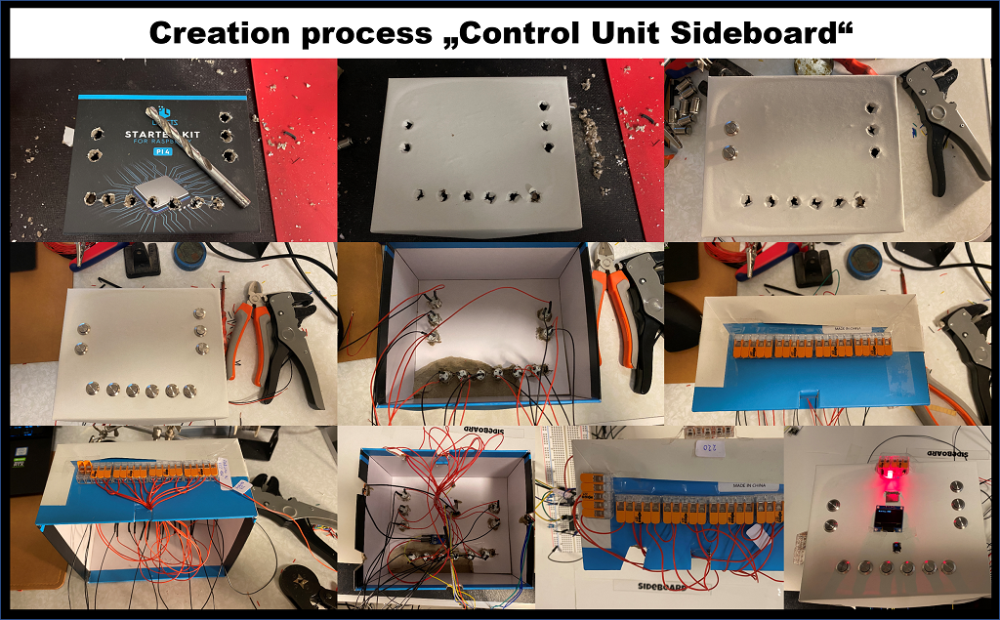
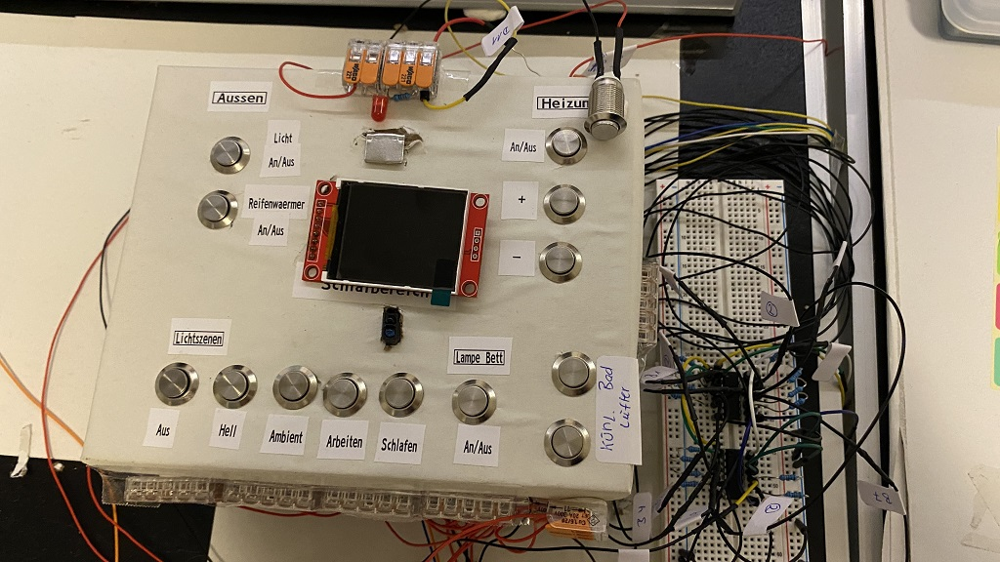
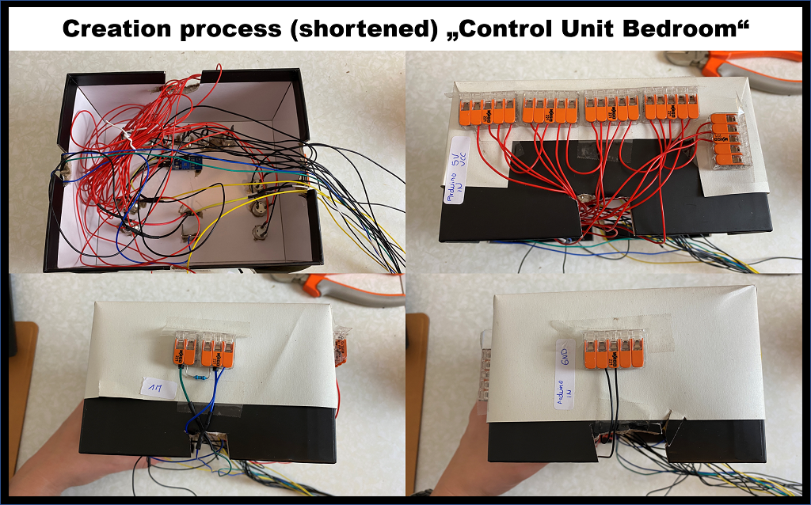

# "Mobile Smart Home" for our DIY Camper Van
With this repo I provide my concepts and some code snippets about our DIY camper van that I will turn into a "Mobile Smart Home" with an Arduino Mega and a bunch of electronic components.
Besides the Arduino Mega I plan in addition to install a Raspberry PI with a nice touch screen which communicates with the Arduino Mega.

## Table of Contents

- [Project Status](#planning-and-overview)
- [Planning and Overview](#planning-and-overview)
  - [Features](#features)
- [Project Management](#project-management)
- [Control Units](#control-units)
  - [Prototype Control Unit Sideboard](#prototype-control-unit-sideboard)
  - [Prototype Control Unit Bedroom](#prototype-control-unit-bedroom)
- [Storyboard Display](#storyboard-display)
- [Lighting Control](#lighting-control)

## Project Status

I started this project recently, so it's in progress. Content and code snippets will be added during my project progress.

Check out also our [DIY Selbstausbau Blog & Vlog Camper Renntransporter](https://trackdates.de/howto/renntransporter/).

## Planning and Overview

## Features

- Creation of two control units, one within the sideboard area the other one within the bedroom area, which offers the following means
  - Turn outside light on or off
  - Turn tire warmers on or off
  - Activation of five different light scenes
    - "Off": Turns all lights off (motion based triggered bathroom light excluded)
    - "Bright": Turns all lights on with maximum brightness level (motion based triggered bathroom light excluded)
    - "Ambient": Turns all lights on with low brightness level, orange light (motion based triggered bathroom light excluded)
    - "Work": Turns all lights on with medium brightness level, white light
    - "Sleep": Activates motion detector in corridor area. When motion is detected one light is activated in red color on lowest brightness level and the bathroom light is switched to red color in lowest brightness level when within the bathroom area a motion is detected.
  - Turn bedroom light on or off
  - Turn heater on or off
  - Increase or decrease of heater temperature
  - Touch area to switch between the different display states (please refer to [Storyboard Display](#storyboard-display))
    - Default: Shows TBD
    - Water ingress status: Shows TBD
    - Climate status: Shows TBD
    - Timer: TBD
    - Time and Date Setting: TBD
    - System Settings: TBD
  - Control unit is illuminated automatically as well as display is turned on for a specific duration in case of your hand comes near the control unit
  - Display is turned on for a specific duration in case of touch or button push is detected
  - You can set a timer when the tire warmers should be turned on (only control unit sideboard)
  - You can set date and time (only control unit sideboard)
- Bathroom light turns on automatically for a specific duration in case of motion is detected (color and brightness level depends on currently activated light scene)
- Bathroom fan turns on automatically in case of specific humidity threshold overrun is detected
- Fans located in fridge closet turn on automatically in case of specific temperature threshold overrun is detected
- Water tank level monitoring
- Water ingress level monitoring
- Temperature and humidity monitoring

Integration of
- 230V lights (4 pieces) with IR control from different vendor
- 12V diesel heater with RF control
- 230V RF sockets (2 pieces)
- 12V fans (3 pieces)
- TBD

## Project Management

For the management of this project I have set up a trello board (Kamil acts as tester as well as a requirements stakeholder like me):

Please note that I've blackened most of the story cards!

I have break down all requirements / stuff I have to build and implement in the course of this project into stories, here is an example story:

## Control Units

### Prototype Control Unit Sideboard

Current Prototype (only for testing purposes) and the creation process behind:
(Note: Must be adapted to the latest control units concept, two buttons are missing as well as the second LED must be removed.)

### Prototype Control Unit Bedroom

Current Prototype (only for testing purposes) and the creation process behind (same as for sideboard, therefore shortened):
(Note: Must be adapted to the latest control units concept, two buttons are missing.)

## Storyboard Display

## Lighting Control

