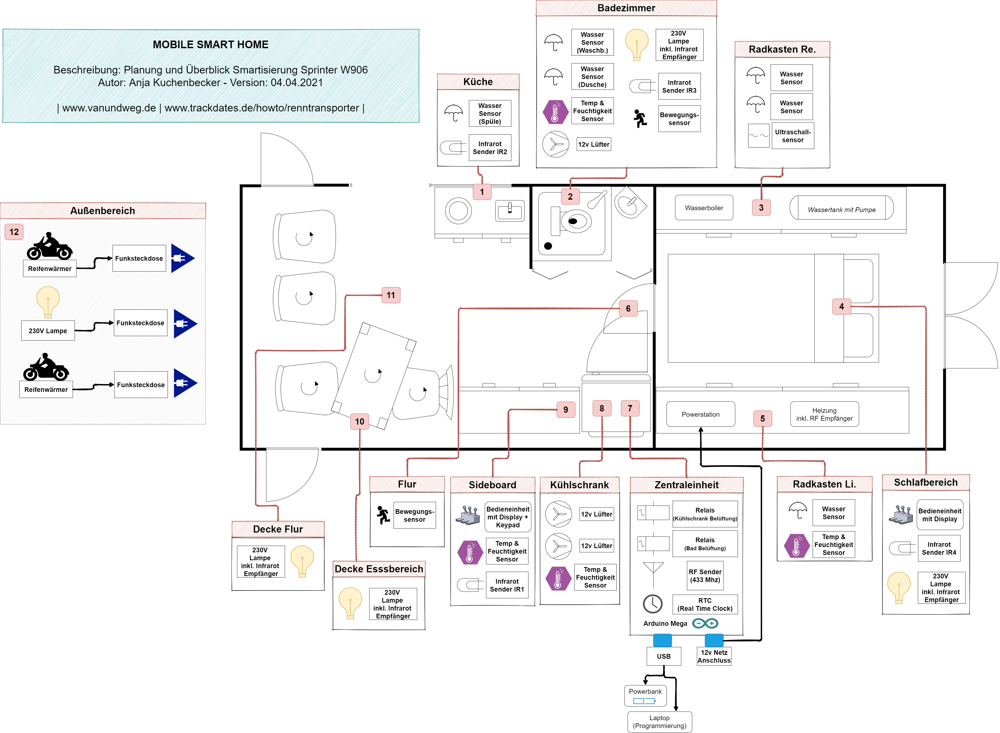
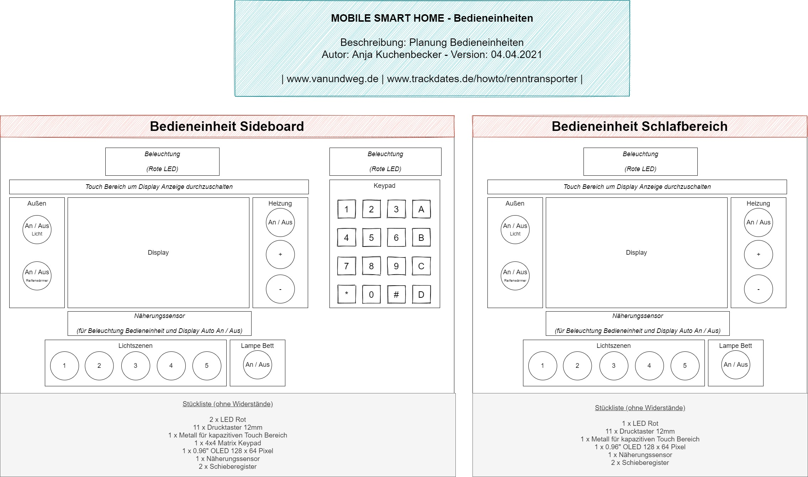

# "Mobile Smart Home" for our DIY Camper Van
With this repo I provide my concepts and some code snippets about our DIY camper van that I will turn into a "Mobile Smart Home" with an Arduino Mega and a bunch of electronic components.
Besides the Arduino Mega I plan in addition to install a Raspberry PI with a nice touch screen which communicates with the Arduino Mega.

## Table of Contents

- [Project Status](#planning-and-overview)
- [Planning and Overview](#planning-and-overview)
- [Control Units](#control-units)

## Project Status

I started this project recently, so it's in progress. Content and code snippets will be added during my project progress.

## Planning and Overview

Features
* TBD

## Control Units

