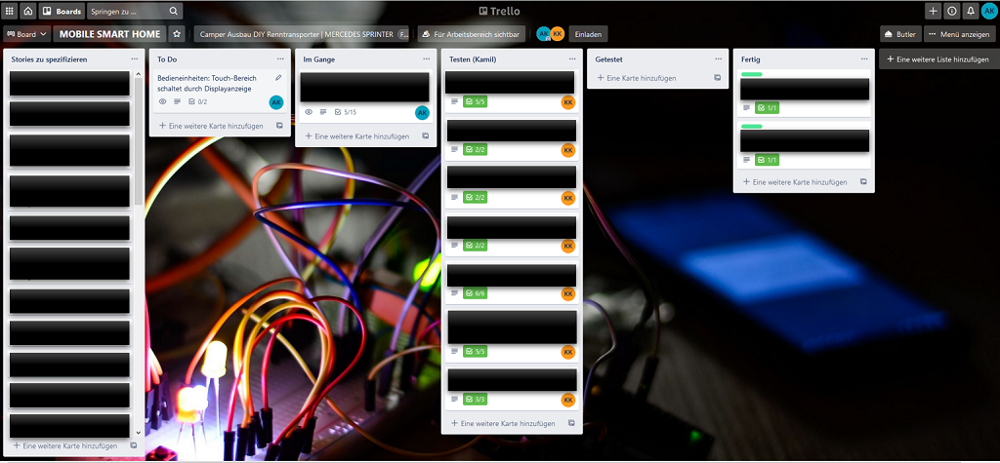
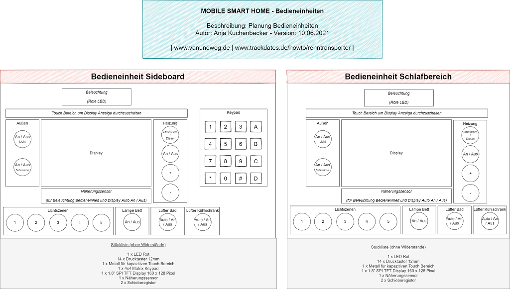

# "Mobile Smart Home" for our DIY Camper Van
With this repo I provide my concepts and some code snippets about our DIY camper van that I will turn into a "Mobile Smart Home" with an Arduino Mega and a bunch of electronic components.
Besides the Arduino Mega I plan in addition to install a Raspberry PI with a nice touch screen which communicates with the Arduino Mega.

## Table of Contents

- [Project Status](#project-status)
- [Planning and Overview](#planning-and-overview)
- [Features](#features)
- [Project Management](#project-management)
- [Overall Prototyping Status](#overall-prototyping-status)
- [Control Units](#control-units)
  - [Prototype Control Unit Sideboard](#prototype-control-unit-sideboard)
  - [Prototype Control Unit Bedroom](#prototype-control-unit-bedroom)
- [Storyboard Display](#storyboard-display)
  - [Display Implementation](#display-implementation)
- [Lighting Control](#lighting-control)
- [Example Sketches](#example-sketches)

## Project Status

Prototyping is completed! I've soldered a lot, physically installed all of the electronic components and wrote over 4500 lines of code. Next step is to transform this prototype setup into final units, which can I install into our Sprinter.

Check out also our [DIY Selbstausbau Blog & Vlog Camper Renntransporter](https://trackdates.de/howto/renntransporter/).

Example sketches can be found here: [Example Sketches](#example-sketches) 

## Planning and Overview

## Features

- Creation of two control units, one within the sideboard area the other one within the bedroom area, which offers the following means
  - Turn outside light on or off
  - Turn tire warmers on or off
  - Activation of five different light scenes
    - "Off": Turns all lights off (motion based triggered bathroom light excluded)
    - "Bright": Turns all lights on with maximum brightness level (motion based triggered bathroom light excluded)
    - "Ambient": Turns all lights on with low brightness level, orange light (motion based triggered bathroom light excluded)
    - "Work": Turns all lights on with medium brightness level, white light
    - "Sleep": Activates motion detector in corridor area. When motion is detected one light is activated in red color on lowest brightness level and the bathroom light is switched to red color in lowest brightness level when within the bathroom area a motion is detected.
  - Turn bedroom light on or off
  - Switch between shore power heater and diesel heater control
  - Turn (shore power or diesel) heater on or off
  - Increase or decrease of (shore powert or diesel) heater temperature
  - Touch area to switch between the different display states (please refer to [Storyboard Display](#storyboard-display))
    - Default: [Default Screen Implementation](#default-screen-implementation)
    - Water ingress monitor: Shows TBD
    - Climate monitor: Shows TBD
    - Tire Warmers Timer: TBD
    - Time and Date Setting: TBD
    - System Settings: TBD
  - Control unit is illuminated automatically as well as display is turned on for a specific duration in case of your hand comes near the control unit
  - Display is turned on for a specific duration in case of touch or button push is detected
  - You can set a timer when the tire warmers should be turned on (only via control unit sideboard)
  - You can set date and time (only via control unit sideboard)
- Bathroom light turns on automatically for a specific duration in case of motion is detected (color and brightness level depends on currently activated light scene)
- Bathroom fan turns on automatically in case of specific humidity threshold overrun is detected
- Fans located in fridge closet turn on automatically in case of specific temperature threshold overrun is detected
- Water tank level monitoring
- Water ingress level monitoring
- Temperature and humidity monitoring
- Change of system configuration parameters
  - LED and background light duration of control units
  - Temperature threshold for fridge fans
  - Humidity threshold for bathroom fan
  - Water ingress threshold for water sensors
  - Distance recognition threshold for sideboard control unit
  - Touch recognition threshold for sideboard control unit 
  - Distance recognition threshold for bed control unit
  - Touch recognition threshold for bed control unit 
- Permanently storage of system configuration parameters

## Integration of the following hardware components 

Total: 106 components
- 230V lights (4 pieces) with IR control from different vendor (e.g., iDual)
- 230V shore power heater with IR control
- 12V diesel heater with RF control
- 230V RF sockets (2 pieces)
- 80x80x25mm fan (1 piece; 12V, 76,4m^3/h, 38dBA)
- 120x120x25mm fans (2 pieces; 12V, 127,3m^3/h, 34dBA)
- Water Sensors (6 pieces; SE045)
- Ultrasonic sensor (1 piece; HC-SR04)
- IR-Emitter (5 pieces; TSAL 6200 IR-Emitter 940nm)
- Motion Sensors (2 pieces; HC-SR501)
- Temperature & Humidity Sensors (4 pieces; DHT22)
- TFT Displays (2 pieces; 1.8 Zoll SPI ST7735 TFT Display 128 x 160 Pixel)
- Line Follower IR Sensor (2 pieces; TCRT5000)
- Shift registers (4 pieces; 74HC165)
- Real Time Clock (1 piece; DS3231)
- Relais Module (1 piece; 4-Relais Modul 5V)
- NPN-Transistor (1 piece; PN2222)
- External EEPROM Module (1 piece; AT24C256 I2C Interface EEPROM)
- RF 433 MHz Transmitter (1 piece; H34A)
- Arduino Mega 2560 compatible microcontroller board (1 piece; ELEGOO Mega2560 R3)
- Momentary Push Buttons (28 pieces; 12mm)
- Different resistors

## Project Management

For the management of this project I have set up a trello board (Kamil acts as tester as well as a requirements stakeholder like me):

Please note that I've blackened most of the story cards!

I have break down all requirements / stuff I have to build and implement in the course of this project into stories, here is an example story:

## Overall Prototyping Status

## Control Units

### Prototype Control Unit Sideboard

Current Prototype (only for testing purposes) and the creation process behind:

### Prototype Control Unit Bedroom

Current Prototype (only for testing purposes) and the creation process behind (same as for sideboard, therefore shortened):

## Storyboard Display

### Display Implementation

According to my storyboard concept, I implemented the screens and screen workflow.
By usage of the touch area, you switch between the six main screens as they are depicted in the following screenshots. Some screens enables the possiblity to enter values and perform actions via the keypad. In the "System Settings" screen you can go to a specific setting by hitting the related key on the keypad.

#### Default Screen Implementation

#### Water ingress status Screen Implementation

#### Climate status Screen Implementation

#### Tire Warmers Timer Implementation

#### Time and Date Setting Implementation

#### System Settings Implementation

##### Light Duration Configuration

##### Fridge Fan Temperature Threshold Configuration

##### Bathroom Fan Humidity Threshold Configuration

##### Water Sensor Threshold Configuration

##### Sideboard Distance Threshold Configuration

##### Sideboard Touch Threshold Configuration

##### Bed Distance Threshold Configuration

##### Bed Touch Threshold Configuration

## Lighting Control Implementation

## Example Sketches

Within the [wiki](https://github.com/anjakuchenbecker/mobile_smart_home_diy_camper_van/wiki) you find some example sketches with respect to different topics, which are maybe useful for your purposes: 

- [Four Daisy Chained 74HC165 Shift Registers (Multiple Shift Registers)](https://github.com/anjakuchenbecker/mobile_smart_home_diy_camper_van/wiki/Four-Daisy-Chained-74HC165-Shift-Registers-(Multiple-Shift-Registers))

## Usage of the following software libs
- *ucglib* by Oli Kraus for TFT Display integration: https://github.com/olikraus/ucglib
- *Capacitive Sensing Library* by Paul Badger for touch area integration: https://github.com/PaulStoffregen/CapacitiveSensor
- *IRremote* by shirriff, z3t0, Armin Joachimsmeyer for IR communication integration: https://github.com/Arduino-IRremote/Arduino-IRremote
- *Keypad Library* for Arduino by Mark Stanley, Alexander Brevig for keypad integration: https://playground.arduino.cc/Code/Keypad/
- *DHT sensor library* by adafruit for DHT22 temperature and humidity sensor integration: https://github.com/adafruit/DHT-sensor-library
- *rc-switch* by sui77 for H34A RF 433 Mhz Transmitter integration: https://github.com/sui77/rc-switch
- *RTClib* by adafruit for DS3231 Real Time Clock (RTC) integration: https://github.com/adafruit/RTClib
- *Wire library* for external EEPROM (AT24C256 I2C Interface EEPROM) integration: https://www.arduino.cc/en/Reference/Wire
