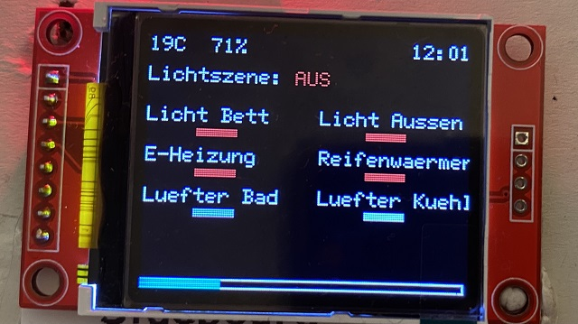

# "Mobile Smart Home" for our DIY Camper Van

With this repo I provide my concepts and some code snippets (example sketches) about our DIY camper van that I will turn into a "Mobile Smart Home" with an Arduino Mega and a bunch of electronic components.
Besides the Arduino Mega I plan in addition to install a Raspberry PI with a nice touch screen which communicates with the Arduino Mega.

## Table of Contents

- [Project Status](#project-status)
- [Planning and Overview](#planning-and-overview)
- [Features](#features)
- [Integration of the following hardware components](#integration-of-the-following-hardware-components)
- [Project Management](#project-management)
- [Overall Prototyping Status](#overall-prototyping-status)
- [Control Units](#control-units)
  - [Prototype Control Unit Sideboard](#prototype-control-unit-sideboard)
  - [Prototype Control Unit Bedroom](#prototype-control-unit-bedroom)
- [Storyboard Display](#storyboard-display)
  - [Display Implementation](#display-implementation)
- [Lighting Control Concept](#lighting-control-concept)
- [Example Sketches](#example-sketches)

## Project Status

Prototyping is completed! I've soldered a lot, physically installed all of the electronic components and wrote over 4500 lines of code. Next step is to transform this prototype setup into final units, which can I install into our Sprinter.

Check out also our [DIY Selbstausbau Blog & Vlog Camper Renntransporter](https://trackdates.de/howto/renntransporter/).

Example sketches can be found here: [Example Sketches](#example-sketches) 

## Planning and Overview

I've planned to install a bunch of components in the different areas within our Sprinter

## Features

The main features of self-made "Mobile Smart Home" solution are as follows

- Creation of two control units, which replace the handling different IR / RF vendor remote controls. One within the sideboard area the other one within the bedroom area, which offers the following means
  - Turn outside light on or off
  - Turn tire warmers on or off
  - Activation of five different light scenes (please refer to [Lighting Control Concept](#lighting-control-concept))
    - "Off": Turns all lights off (motion based triggered bathroom light excluded)
    - "Bright": Turns all lights on with maximum brightness level (motion based triggered bathroom light excluded)
    - "Ambient": Turns all lights on with low brightness level, orange light (motion based triggered bathroom light excluded)
    - "Work": Turns all lights on with medium brightness level, white light
    - "Sleep": Activates motion detector in corridor area. When motion is detected one light is activated in red color on lowest brightness level and the bathroom light is switched to red color in lowest brightness level when within the bathroom area a motion is detected.
  - Turn bedroom light on or off (separately despite the current enabled light scene)
  - Switch between electric heater and diesel heater control
  - Turn (electric or diesel) heater on or off
  - Increase or decrease of (electric or diesel) heater temperature
  - Touch area to switch between the different display states (please refer to [Storyboard Display](#storyboard-display))
    - [Default Screen](#default-screen-implementation)
    - [Water ingress status Screen](#water-ingress-status-screen-implementation)
    - [Climate status Screen](#climate-status-screen-implementation)
    - [Tire Warmers Timer](#tire-warmers-timer-implementation)
    - [Time and Date Setting](#time-and-date-setting-implementation)
    - [System Settings](#system-settings-implementation)
      - [Light Duration Configuration](#light-duration-configuration-implementation)
      - [Fridge Fan Temperature Threshold Configuration](#fridge-fan-temperature-threshold-configuration-implementation)
      - [Bathroom Fan Humidity Threshold Configuration](#bathroom-fan-humidity-threshold-configuration-implementation)
      - [Water Sensor Threshold Configuration](#water-sensor-threshold-configuration-implementation)
      - [Sideboard Distance Threshold Configuration](#sideboard-distance-threshold-configuration-implementation)
      - [Sideboard Touch Threshold Configuration](#sideboard-touch-threshold-configuration-implementation)
      - [Bed Distance Threshold Configuration](#bed-distance-threshold-configuration-implementation)
      - [Bed Touch Threshold Configuration](#bed-touch-threshold-configuration-implementation)
  - Control unit is illuminated automatically as well as display is turned on for a specific duration in case of your hand comes near the control unit
  - Display is turned on for a specific duration in case of touch or button push is detected
  - You can set a timer when the tire warmers should be turned on (only via control unit sideboard)
  - You can set date and time (only via control unit sideboard)
- Bathroom light turns on automatically for a specific duration in case of motion is detected (color and brightness level depends on currently activated light scene)
- Bathroom fan turns on automatically in case of specific humidity threshold overrun is detected
  - Behavior can be overruled by permanently on and off mode
- Fans located in fridge closet turn on automatically in case of specific temperature threshold overrun is detected
  - Behavior can be overruled by permanently on and off mode
- Water tank level monitoring
- Water ingress level monitoring
- Temperature and humidity monitoring
- Change of system configuration parameters
  - LED and background light duration of control units
  - Temperature threshold for fridge fans
  - Humidity threshold for bathroom fan
  - Water ingress threshold for water sensors
  - Distance recognition threshold for sideboard control unit
  - Touch recognition threshold for sideboard control unit 
  - Distance recognition threshold for bed control unit
  - Touch recognition threshold for bed control unit 
- Permanently storage of system configuration parameters
- Pluggable main unit ("Zentraleinheit"): One the one hand the main unit can be easily put out during winter time, when our Sprinter is not in use. On the other hand it can be easily put in temporary, also during winter time, to check if there are no issues (e.g., water ingress) operated with the support of a USB power bank.

## Integration of the following hardware components 

Total: 115 components
- Arduino Mega 2560 compatible microcontroller board (1 piece; ELEGOO Mega2560 R3)
  -   
- Screw / Terminal Block Shield Board Kit For ArduinoMEGA-2560 R3
  -   
- 230V lights (4 pieces) with IR remote control from different vendors (e.g., iDual)
  - 
  - 
- 230V electric heater with IR remote control
  -   
- 12V diesel heater with RF remote control
  -   
- 230V RF sockets (2 pieces) with RF remote control
  -  
- 80x80x25mm fan (1 piece; 12V, 76,4m^3/h, 38dBA)
  -   
- 120x120x25mm fans (2 pieces; 12V, 127,3m^3/h, 34dBA)
  -    
- Water Sensors (6 pieces; SE045)
  - 
- Ultrasonic sensor (1 piece; HC-SR04)
  -   
- IR-Emitter (5 pieces; TSAL 6200 IR-Emitter 940nm)
  -  
- Motion Sensors (2 pieces; HC-SR501)
  - 
- Temperature & Humidity Sensors (4 pieces; DHT22)
  -  
- TFT Displays (2 pieces; 1.8 Zoll SPI ST7735 TFT Display 128 x 160 Pixel)
  -   
- Line Follower IR Sensor (2 pieces; TCRT5000)
  -    
- Shift registers (4 pieces; 74HC165)
  -  
- Real Time Clock (1 piece; DS3231)
  -  
- Relais Module (1 piece; 4-Relais Modul 5V)
  -  
- NPN-Transistor (1 piece; PN2222)
  -  
- External EEPROM Module (1 piece; AT24C256 I2C Interface EEPROM)
  -  
- RF 433 MHz Transmitter (1 piece; H34A)
  -   
- Momentary Push Buttons (28 pieces; 12mm)
  -  
- Different resistors

## Project Management

For the management of this project I have set up a trello board (Kamil acts as tester as well as a requirements stakeholder like me):

Please note that I've blackened most of the story cards!

 

I have break down all requirements / stuff I have to build and implement in the course of this project into stories, here is an example story:

 

## Overall Prototyping Status

 

## Control Units

I created a functional concept for the control units, that I plan to build for our Sprinter.

### Prototype Control Unit Sideboard

Current Prototype (only for testing purposes) and the creation process behind:

 

 

### Prototype Control Unit Bedroom

Current Prototype (only for testing purposes) and the creation process behind (same as for sideboard, therefore shortened):

 

 

## Storyboard Display

Before I started with the display implementation I created a storyboard for the display content and UI-Workflow.
Please be aware that such a storyboard depicts not the final UI design. It should "only" represent which information should be displayed in which situation.

### Display Implementation

According to my storyboard concept, I implemented the screens and screen workflow.
By usage of the touch area, you switch between the six main screens as they are depicted in the following screenshots. Some screens enables the possiblity to enter values and perform actions via the keypad. In the "System Settings" screen you can go to a specific setting by hitting the related key on the keypad.

#### Default Screen Implementation

The default screen shows the following information
- Current main temperature and humidity
- Current time
- Tire warmers timer indicator (only if timer has been set)
- Overall water ingress status level indicator (only if at least one water ingress threshold is exceeded)
- Currently selected light screne ("AUS", "HELL", "AMBIENT", "ARBEITEN", "SCHLAFEN" )
- Bed light status indicator (green: on; red: off)
- Outside light indicator (green: on; red: off)
- Currently selected heater ("E-Heizung" or "D-Heizung)
- Heater status indicator (green: on; red: off)
- Tire warmers indicator (green: on; red: off)
- Bathroom fan indicator (grey: auto mode; green: permanently on; red: permanently off)
- Fridge closet fans indicator (grey: auto mode; green: permanently on; red: permanently off)
- Water tank water level indicator (blue bar, width based on current level)

#### Water ingress status Screen Implementation

The water ingress status screen acts as monitoring for the installed water sensors. 
In case of the configured water ingress threshold is exceeded the related area name (where water sensor is installed) is tinted in red otherwise in green.

#### Climate status Screen Implementation

The climate status screen acts as monitoring for the installed temperature and humidity sensors. 
In case of the humidity of a sensor is at least 65, the related humidity for that area is tinted in red otherwise in green.

#### Tire Warmers Timer Implementation

A timer can be set for the tire warmers, which are connected to RF sockets. 
Yes, that sounds crazy, but is soooo useful :-) 
Race events usually start early in the morning and with this feature the is no need to go out right after getting up and plug in your tire warmers.

Input is made via the keypad. There is also an input validation and a timer reset option.

#### Time and Date Setting Implementation

The time and the date can be set. Input is made via the keypad. There is also an input validation.

#### System Settings Implementation

All important system setting are configurable. From this screen you can jump into each configuration area by using the related keypad button (1-8).

##### Light Duration Configuration Implementation

The illumination duration of the TFT backlight and LEDs can be configured here.
Input is made via the keypad. There is also an input validation.

##### Fridge Fan Temperature Threshold Configuration Implementation

The temperature threshold, when the fans located in fridge closet should turn on automatically (only in auto mode), can be configured here.

##### Bathroom Fan Humidity Threshold Configuration Implementation

The humidity threshold, when the fan within the bathroom should turn on automatically (only in auto mode), can be configured here.

##### Water Sensor Threshold Configuration Implementation

The water sensor threshold, that determines when water ingress should be reported.

##### Sideboard Distance Threshold Configuration Implementation

As Line Follower IR Sensor (TCRT5000) can be influenced by the incidence of light (depending on where the control unit is physically installed), you are able to configure the distance threshold of the sideboard control unit.

##### Sideboard Touch Threshold Configuration Implementation

The sideboard touch threshold, that controls how sensitive the touch area at the sideboard control unit should react.

##### Bed Distance Threshold Configuration Implementation

As Line Follower IR Sensor (TCRT5000) can be influenced by the incidence of light (depending on where the control unit is physically installed), you are able to configure the distance threshold of the bedroom control unit.

##### Bed Touch Threshold Configuration Implementation

The bed touch threshold, that controls how sensitive the touch area at the bedroom control unit should react.

## Lighting Control Concept

In order to use not all the different vendor specific IR remote controls to control our 230V lamps we use in our Sprinter, I've defined a lighting control concept. With only one button press, the related light scene is activated. In the background the previously recorded IR codes are sent by the different IR transmitter units. 

Each IR emitter unit can be requested separately. In our case this is very important, because three of the four lamps are from the same vendor (iDual) and their concept is that you can drive all iDual lamps with one IR remote control. 

The cool thing is here, that I can share the digital pin signal (in my case this is pin D9), which sends the IR signals, between all units. Meaning I can drive the five IR emitter units with one popular library for sending IR signals, as when I driving only one IR emitter.

As a result, I place the several IR transmitter units at the right place and ensure that I only activate the proper unit(s) to send IR codes, when needed.

In total I've build five IR transmitter units, but only four are for the lamps. The fifth one is for controlling the 230V electric heater.

The different supported light scenes as well as the separated control of the lamp within the bathroom are as follows:

## Example Sketches

Within the [wiki](https://github.com/anjakuchenbecker/mobile_smart_home_diy_camper_van/wiki) you find some example sketches with respect to different topics, which are maybe useful for your purposes: 

- [Four Daisy Chained 74HC165 Shift Registers (Multiple Shift Registers)](https://github.com/anjakuchenbecker/mobile_smart_home_diy_camper_van/wiki/Four-Daisy-Chained-74HC165-Shift-Registers-(Multiple-Shift-Registers))
- [1.8 SPI TFT Display ST7735 128x160 pixel with programmatic backlight control](https://github.com/anjakuchenbecker/mobile_smart_home_diy_camper_van/wiki/1.8-SPI-TFT-Display-ST7735-128x160-pixel-with-programmatic-backlight-control)

## Usage of the following software libs

Thanks to these guys:
- *ucglib* by Oli Kraus for TFT Display integration: https://github.com/olikraus/ucglib
- *Capacitive Sensing Library* by Paul Badger for touch area integration: https://github.com/PaulStoffregen/CapacitiveSensor
- *IRremote* by shirriff, z3t0, Armin Joachimsmeyer for IR communication integration: https://github.com/Arduino-IRremote/Arduino-IRremote
- *Keypad Library* for Arduino by Mark Stanley, Alexander Brevig for keypad integration: https://playground.arduino.cc/Code/Keypad/
- *DHT sensor library* by adafruit for DHT22 temperature and humidity sensor integration: https://github.com/adafruit/DHT-sensor-library
- *rc-switch* by sui77 for H34A RF 433 Mhz Transmitter integration: https://github.com/sui77/rc-switch
- *RTClib* by adafruit for DS3231 Real Time Clock (RTC) integration: https://github.com/adafruit/RTClib
- *Wire library* for external EEPROM (AT24C256 I2C Interface EEPROM) integration: https://www.arduino.cc/en/Reference/Wire
